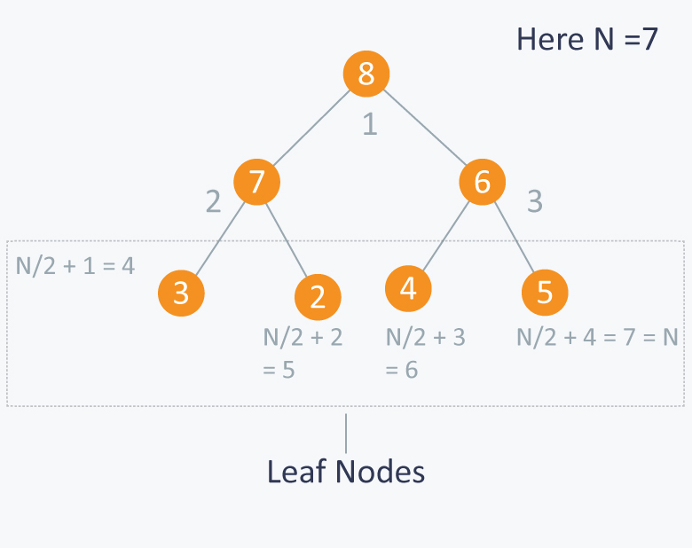

# Heap Data Structure :

## Priority-Queue :

There are multiple ways to implement a Priority Queue, such as array and linked list. However, these implementations only guarantee O(1)O(1) time complexity for either insertion or deletion, while the other operation will have a time complexity of O(N)O(N). On the other hand, implementing the priority queue with Heap will allow both insertion and deletion to have a time complexity of O(\log N)O(logN).A priority queue is an abstract data type similar to a regular queue or stack data structure in which each element additionally has a "priority" associated with it. In a priority queue, an element with high priority is served before an element with low priority.

A common misconception is that a Heap is the same as a Priority Queue, which is not true. A priority queue is an abstract data type, while a Heap is a data structure. Therefore, a Heap is not a Priority Queue, but a way to implement a Priority Queue

There are multiple ways to implement a Priority Queue, such as array and linked list. However, these implementations only guarantee O(1)O(1) time complexity for either insertion or deletion, while the other operation will have a time complexity of O(N)O(N). On the other hand, implementing the priority queue with Heap will allow both insertion and deletion to have a time complexity of O(\log N)O(logN).

## Definition of Heap

A heap is a special binary tree. A heap is a binary tree which meets following criteria :

- Is a complete binary tree.
- The value of each node should be greater than or equal to the value of its child node.

A Heap has the following properties :

- Insertion of an element into the Heap has a time complexity of O(log N);
- Deletion of an element from the Heap has a time complexity of O(log N);
  -The maximum/minimum value in the Heap can be obtained with O(1)O(1) time complexity.

## Classification of Heap

There are two kinds of heaps: **Max Heap** and **Min Heap**.

- Max Heap: Each node in the Heap has a value **no less than** its child nodes. Therefore, the top element (root node) has the **largest** value in the Heap.

- Min Heap: Each node in the Heap has a value **no larger than** its child nodes. Therefore, the top element (root node) has the **smallest** value in the Heap.

## Representation of Binary Tree in Arrays :

An array can be used to simulate a tree, indexing is done such that it preserves the nature of binary tree and properties of heap as well. Some indexing nomenclature used :

- Parent : (i - 1) / 2;
- Left Child : i \* 2 + 1;
- Right Child : i \* 2 + 2;

All the indices greater than **N / 2** are leaf nodes. For example :

## Implementation Details

- **Heapify** : Heapify function make sure heap property for current node is hold by checking and swapping value with childrent nodes. **Time Complexity : O(log N)**

- **Build Heap** : This function is use to convert an array into required heap. It just makes heapify call to all non-leaf nodes. **Time Complexity : O(N)**

- **Insert** : We will insert at the end. Bubble it up. **Time Complexity : O(log N)**

- **Delete** : To delete top element of heap we will set the last element of heap as root and decrement size and call heapify function to rebalance the entire heap. **Time Complexity : O(log N)**

## Heapsort :

Suppose we are required to sort an array in non-decreasing order(Ascending order) than we will just build a max-heap with array and then one by one we will swap root with last element of heap, call heapify function on current root with N - 1 size. At the end we will get sorted array.

> Time Complexity : O(NlogN)
